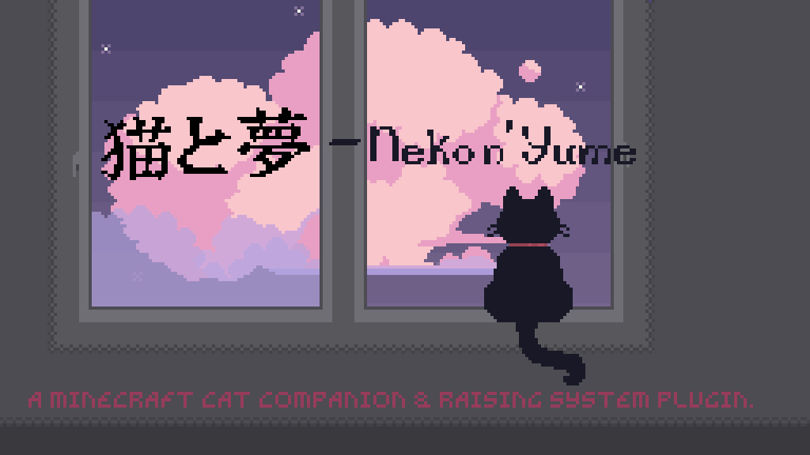

  

  <a href="../README.md">简体中文</a> ·
  <a href="README.zh-TW.md">繁體中文</a> ·
  <a href="README.en.md">English</a> ·
  <a href="README.ja.md">日本語</a>

> あなたと猫が、ブロックの世界で優しいひとときを共に過ごせますように。

---

## 🌸 はじまり

ある日、あなたは作業台で、生鱈と棒を使い、今まで見たことのないものを作り出しました。

そこには名前も刻まれていません。

ただ、眠る一匹の猫と、そっと尋ねる言葉だけがありました。

> 「猫を一匹、連れて帰りませんか？」

こうして、猫と夢をめぐる旅が、静かに始まりました。

---

## 🐾 はじめまして · 絆のかたち

一匹一匹の猫は、みんな違う存在です。

食いしん坊で、お皿の底まできれいになめる子。のんびり屋で、午後になると軒下で昼寝をする子。甘えん坊で、いつもあなたのそばを離れたがらない子。そして、気分がいいときだけ小さな頭を撫でさせてくれる、独立心の強い誇り高き子。

生まれたばかりの頃、その多くは「普通」の子です。

けれど、ごくわずかな幸運な子たちは、生まれながらに「レア」の輝きを宿しています。

それでも、その先の運命まで決まっているわけではありません。

それは、あなたと猫が一緒に紡いでいく物語なのです。

「至極喵丹」を与えてみましょう。

月明かりのような光をたたえた小さな丸薬が、猫をそっと変えてくれるかもしれません——普通からレアへ、レアからユニークへ。そして最後には、夢の中でしか出会えないような「夢幻」の姿へ。

餌をあげるたび、それは鼓動のような、小さな期待の瞬間です。

覚えておいてください。

始まりは星明かりの中に記されても、その子が最後に放つ輝きは、あなたたち二人で灯していくものなのです。

---

## 🌙 ともに · 優しく寄り添って

猫は、心を込めて育てるものです。

好きなものを食べさせ、そっと顎を撫で、一緒に遊ぶ時間を忘れないでください。

猫の気分は天気のように変わります——嬉しかったり、楽しかったり、穏やかだったり。ときには少し落ち込んだり、悲しくなったりすることもあります。

あなたが優しく接すれば、猫もまた、日々深まっていく絆で応えてくれます。

見知らぬ者同士から、かけがえのない仲間へ。そして、心と心が通じ合う存在へ。

お腹が空けばあなたを探しに来ます。

嬉しいときは、あなたの足元にすり寄ってきます。

傷ついたときには、安心を求めてあなたの腕の中へ隠れてくるかもしれません。

どうか、あまり長く放っておかないでください。

忘れられた猫は、悲しんでしまうのです。

---

## ⚔️ 守護 · 爪と月明かり

ふわふわした見た目に、騙されてはいけません。

危険が訪れたとき、普段はのんびりしている猫も、迷うことなくあなたの前に立ちはだかります。

飛びかかり、霊弾、鋭い爪、そして月明かり。

それらすべてが、猫の武器です。

さらに、猫には自分だけの小さな力があります——二十種類を超える、能動・受動の「夢のスキル」。

あなたと猫の心が通じ合うほど、それらは一つずつ目を覚ましていきます。

傷ついた猫は、しばらくの間「回復期間」に入り、半透明の影となって静かに癒えるのを待ちます。

中には九つの命を持つ特別な子や、月明かりの下で永遠を得る子もいます。

忘れないでください。

あなたを守っているときでさえ、その猫はきっと、振り返ったあなたから小さな干し魚をもらえるのを待っています。

---

## 🎀 小さなもの · 夢からの贈り物

旅の途中では、たくさんの不思議なものに出会うでしょう——

「喵丹」は猫の成長を助け、「経験丸」はその先の道を切り開きます。

そして、首輪、鈴、リボン……二十五種類の精巧な装備もあります。

その一つ一つに、小さな優しい魔法が込められています。

ときには、猫から小さな贈り物をもらうこともあります。

それは、気持ちを言葉にするのが少し苦手な猫が、勇気を出して差し出してくれた想いなのかもしれません。

そして、あなたと猫が十分な物語を共に過ごしたとき、「実績殿堂」に小さな灯りがともります。

そこには、二人の間に生まれた、忘れたくない一つ一つの瞬間が収められていくのです。

---

## 🌒 夢魔の夜

夜空が、いつもより少し暗く見える夜があります。

夢魔が現れ、怪物たちは騒がしく、そして強くなります。

けれど、あなたの猫は恐れません。

夢から生まれたこの子にとって、夢の中の嵐こそが戦場なのです。

猫を連れて、勇気ある者だけが受け取れる贈り物を探しに行きましょう。

---

## ✉️ 結び

この小さな世界には、世界を揺るがすような物語はありません。

ただ、猫たちと、あなた。

そして、いくつもの穏やかな日々があります。

Minecraft プラグイン **猫と夢 · Neko n' Yume** へ、ようこそ。

> 本プロジェクトは、**Mizuki Chou の家で暮らす猫たち**から生まれました。  
> また、インディーゲーム **Yume Nikki** と **Muma Rope** に、心から敬意を表します。

あなたと猫が、ブロックの世界で優しいひとときを共に過ごせますように。